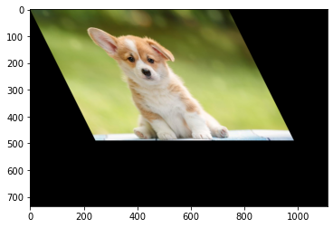

# Image-Transformation
## Aim
To perform image transformation such as Translation, Scaling, Shearing, Reflection, Rotation and Cropping using OpenCV and Python.

## Software Required:
Anaconda - Python 3.7

## Algorithm:
### Step1: 
Import the necessary libraries and read the original image and save it as a image variable.

### Step2:
Translate the image using
M=np.float32([[1,0,20],[0,1,50],[0,0,1]])
translated_img=cv2.warpPerspective(input_img,M,(cols,rows))

### Step3:
Scale the image using
M=np.float32([[1.5,0,0],[0,2,0],[0,0,1]])
scaled_img=cv2.warpPerspective(input_img,M,(cols,rows))
### Step4:
Shear the image using
M_x=np.float32([[1,0.2,0],[0,1,0],[0,0,1]])
sheared_img_xaxis=cv2.warpPerspective(input_img,M_x,(cols,rows))
### Step5:
Reflection of image can be achieved through the code
M_x=np.float32([[1,0,0],[0,-1,rows],[0,0,1]])
reflected_img_xaxis=cv2.warpPerspective(input_img,M_x,(cols,rows))

### Step6:
Rotate the image using
angle=np.radians(45)
M=np.float32([[np.cos(angle),-(np.sin(angle)),0],[np.sin(angle),np.cos(angle),0],[0,0,1]])
rotated_img=cv2.warpPerspective(input_img,M,(cols,rows))

### Step7:
Crop the image using
cropped_img=input_img[20:150,60:230]
And Run the Programs.

## Program:
```python
Developed By:Naveen Kumar.S
Register Number:212221240033

i)Image Translation
import numpy as np
import cv2
import matplotlib.pyplot as plt
input_image=cv2.imread("2.png") 
input_image=cv2.cvtColor(input_image, cv2.COLOR_BGR2RGB) 
plt.axis("off") 
plt.imshow(input_image)
plt.show()
rows, cols, dim = input_image.shape
M= np.float32([[1, 0, 100],
                [0, 1, 200],
                 [0, 0, 1]])
translated_image =cv2.warpPerspective (input_image, M, (cols, rows))
plt.imshow(translated_image)
plt.show()

ii) Image Scaling
rows, cols, dim = input_image.shape
M = np. float32 ([[1.5, 0 ,0],
                 [0, 1.8, 0],
                  [0, 0, 1]])
scaled_img=cv2.warpPerspective(input_image, M, (cols*2, rows*2))
plt.imshow(scaled_img)
plt.show()

iii)Image shearing
rows, cols, dim = input_image.shape
M_x = np.float32([[1, 0.5, 0],
                  [0, 1 ,0],
                  [0, 0, 1]])

M_y = np.float32([[1, 0, 0],
                  [0.5, 1, 0],
                  [0, 0, 1]])
sheared_img_xaxis = cv2.warpPerspective (input_image, M_x, (int(cols *1.5), int (rows *1.5))) 
sheared_img_yaxis = cv2.warpPerspective (input_image, M_y, (int (cols *1.5), int (rows *1.5)))
plt.imshow(sheared_img_xaxis)
plt.show()
plt.imshow(sheared_img_yaxis)
plt.show()

iv)Image Reflection
rows, cols, dim = input_image.shape
M_x=np.float32([[1,0,0],
               [0,-1,rows],
               [0,0,1]])
M_y=np.float32([[-1,0,cols],
               [0,1,0],
               [0,0,1]])
reflected_img_xaxis=cv2.warpPerspective(input_image,M_x,(cols,rows))
reflected_img_yaxis=cv2.warpPerspective(input_image,M_y,(cols,rows))
plt.imshow(reflected_img_yaxis)
plt.show()

v)Image Rotation
angle=np.radians(45)
M=np.float32([[np.cos(angle),-(np.sin(angle)),0],
               [np.sin(angle),np.cos(angle),0],
               [0,0,1]])
rotated_img=cv2.warpPerspective(input_image,M,(cols,rows))
plt.axis('off')
plt.imshow(rotated_img)
plt.show() 

vi)Image Cropping
cropped_img=input_image[0:400,300:600]
plt.axis('off')
plt.imshow(cropped_img)
plt.show()
```
## Output:
 ### i)Image Translation


 ### ii) Image Scaling


### iii)Image shearing



### iv)Image Reflection


### v)Image Rotation


### vi)Image Cropping


## Result: 
Thus the different image transformations such as Translation, Scaling, Shearing, Reflection, Rotation and Cropping are done using OpenCV and python programming.
